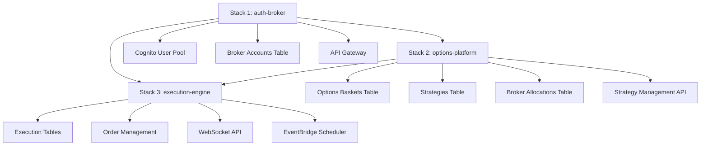

# Options Trading Platform - Technical Design Document

**Version:** 1.0  
**Date:** September 2, 2025  
**Author:** Senior AWS Architect  
**Status:** Implementation Ready

## Table of Contents
1. [Architecture Overview](#architecture-overview)
2. [Enhanced System Design](#enhanced-system-design)
3. [Database Schema](#database-schema)
4. [API Design](#api-design)
5. [Frontend Architecture](#frontend-architecture)
6. [Phase-wise Implementation Plan](#phase-wise-implementation-plan)
7. [Deployment Strategy](#deployment-strategy)
8. [Success Metrics](#success-metrics)

---

## Architecture Overview

### Multi-Stack Design with Strategy-Specific Broker Allocation

```yaml
Stack 1 (Existing): ql-algo-trading-{env}-auth-broker-stack
  Status: ✅ Completed & Deployed
  Purpose: User authentication, broker account management, OAuth integration
  Resources: Cognito, UserProfiles, BrokerAccounts, API Gateway

Stack 2 (New): ql-algo-trading-{env}-options-platform-stack
  Purpose: Basket & strategy management, admin marketplace, strategy-broker allocation
  Dependencies: Stack 1 (imports user pool, broker accounts)
  Key Feature: Strategy-specific broker allocation with flexible lot sizing

Stack 3 (New): ql-algo-trading-{env}-execution-engine-stack  
  Purpose: Real-time order execution, risk management, performance tracking
  Dependencies: Stack 1 & 2 (imports user data, strategies, broker allocations)
  Key Feature: Multi-broker execution with strategy-specific lot configurations
```

### Key Architecture Principles

1. **Strategy-Centric Broker Allocation**: Each strategy within a basket can have different broker configurations
2. **Independent Lot Management**: Strategy A can use 2 lots on Zerodha, while Strategy B uses 5 lots on the same broker
3. **Unified Data Model**: Single table design for admin and user baskets with proper access patterns
4. **Event-Driven Execution**: DynamoDB Streams + EventBridge for real-time order execution
5. **Indian Market Optimization**: NIFTY/BANKNIFTY specialization with proper expiry handling
6. **Marketplace Model**: Admin-created baskets with user subscription capabilities

---

## Enhanced System Design

### Core Entities with Strategy-Specific Broker Allocation

#### 1. Enhanced Baskets Model
```typescript
interface Basket {
  // Primary Keys
  user_id: string;              // PK - Creator's user ID (admin or regular user)
  basket_id: string;            // SK - Unique basket identifier
  
  // Creator & Access Control
  created_by_type: 'ADMIN' | 'USER';
  creator_name: string;         // Display name for marketplace
  creator_user_id: string;      // Explicit creator reference
  
  // Marketplace Configuration
  visibility: 'PRIVATE' | 'PUBLIC' | 'SUBSCRIBERS_ONLY';
  is_marketplace_enabled: boolean;
  subscription_config?: {
    type: 'FREE' | 'PAID' | 'PERFORMANCE_BASED';
    monthly_fee?: number;         // ₹ per month
    performance_fee_percentage?: number; // % of profits
    min_subscription_amount?: number;
    max_subscribers?: number;     // Capacity limit
  };
  
  // Basic Information
  name: string;                 // "Conservative Income Strategy"
  description: string;          // Detailed explanation
  category: 'CONSERVATIVE' | 'AGGRESSIVE' | 'HEDGED' | 'INCOME' | 'MOMENTUM';
  tags: string[];              // ["theta-decay", "weekly-expiry", "nifty"]
  
  // Strategy Management
  strategy_count: number;       // Number of strategies in basket
  active_strategy_count: number;
  
  // Performance & Statistics
  subscriber_count: number;     // 0 for user baskets
  total_aum: number;           // Total assets under management
  performance_metrics: {
    total_return: number;       // Overall basket performance
    sharpe_ratio: number;
    max_drawdown: number;
    win_rate: number;
    monthly_return: number;
    volatility: number;
  };
  
  // Status & Metadata
  status: 'ACTIVE' | 'PAUSED' | 'ARCHIVED';
  created_at: string;
  updated_at: string;
  last_performance_update: string;
}
```

#### 2. Enhanced Strategy Configuration
```typescript
interface Strategy {
  // Primary Keys
  user_id: string;              // PK - Strategy owner
  strategy_id: string;          // SK - Unique strategy identifier
  
  // Relationship
  basket_id: string;            // Parent basket reference
  strategy_number: number;      // 1, 2, 3 within basket
  
  // Basic Information
  name: string;                 // "NIFTY Weekly Iron Condor"
  description: string;          // Strategy explanation
  strategy_type: 'IRON_CONDOR' | 'STRADDLE' | 'STRANGLE' | 'BUTTERFLY' | 'CUSTOM';
  
  // Indian Market Timing (IST)
  execution_schedule: {
    entry_time: string;         // "09:30" IST format
    exit_time: string;          // "15:20" IST format
    entry_days: DayConfig;      // Flexible day configuration
    exit_days: DayConfig;
    timezone: 'Asia/Kolkata';   // Always IST for Indian markets
    
    // DTE (Days to Expiry) Configuration
    dte_config?: {
      min_dte: number;          // Minimum days to expiry
      max_dte: number;          // Maximum days to expiry
      preferred_dte: number;    // Target DTE for entry
    };
  };
  
  // Multi-leg Configuration
  legs: StrategyLeg[];          // Array of option legs
  leg_count: number;            // Number of legs in strategy
  
  // Risk Management
  risk_config: {
    max_loss_per_trade: number;     // ₹ absolute loss limit
    max_loss_percentage: number;    // % of capital loss limit
    position_size_type: 'FIXED_LOTS' | 'PERCENTAGE_OF_CAPITAL' | 'FIXED_AMOUNT';
    position_size_value: number;
    daily_loss_limit: number;       // Maximum daily loss for this strategy
  };
  
  // Performance Tracking
  performance_metrics: {
    total_trades: number;
    winning_trades: number;
    total_pnl: number;
    average_pnl_per_trade: number;
    max_single_loss: number;
    max_single_profit: number;
    current_drawdown: number;
  };
  
  // Status & Control
  status: 'ACTIVE' | 'PAUSED' | 'TESTING' | 'ARCHIVED';
  auto_execute: boolean;        // Enable automatic execution
  created_at: string;
  updated_at: string;
  last_executed: string;
  next_execution: string;
}

// Flexible Day Configuration
interface DayConfig {
  type: 'WEEKDAYS' | 'DTE_BASED' | 'CUSTOM';
  
  // For weekday-based execution
  weekdays?: ('MON'|'TUE'|'WED'|'THU'|'FRI')[];
  
  // For DTE-based execution
  dte_range?: {
    min_dte: number;            // Enter when DTE >= min_dte
    max_dte: number;            // Enter when DTE <= max_dte
  };
  
  // For custom date-based execution
  custom_dates?: string[];      // Specific dates for execution
}
```

#### 3. Enhanced Strategy Leg Configuration
```typescript
interface StrategyLeg {
  leg_id: string;               // Unique identifier within strategy
  leg_number: number;           // Display order (1, 2, 3...)
  
  // Indian Market Underlying Assets
  underlying_config: {
    type: 'INDEX' | 'STOCK';
    symbol: 'NIFTY' | 'BANKNIFTY' | 'FINNIFTY' | 'MIDCPNIFTY' | 'SENSEX' | string;
    exchange: 'NSE' | 'BSE';
    lot_size: number;           // Market-defined lot size
    
    // Indian market specific
    weekly_expiry_day?: 'MONDAY' | 'TUESDAY' | 'WEDNESDAY' | 'THURSDAY' | 'FRIDAY';
    monthly_expiry_day?: 'LAST_THURSDAY';
  };
  
  // Option Configuration  
  option_config: {
    option_type: 'CE' | 'PE';           // Call or Put
    expiry_type: 'WEEKLY' | 'MONTHLY' | 'QUARTERLY';
    expiry_offset: number;              // 0=current expiry, 1=next expiry
    
    // Advanced expiry selection
    expiry_criteria: {
      prefer_nearest: boolean;          // Prefer nearest expiry
      min_dte: number;                  // Minimum days to expiry
      avoid_expiry_day: boolean;        // Avoid trading on expiry day
    };
  };
  
  // Premium Selection Strategy (Enhanced)
  premium_selection: {
    type: 'ATM' | 'OTM' | 'ITM' | 'ABSOLUTE_PREMIUM' | 'DELTA_BASED' | 'PERCENTAGE_BASED' | 'PREMIUM_RANGE';
    
    // Strike-based selection
    strike_offset?: number;             // Points away from ATM
    strike_percentage?: number;         // % away from current price
    
    // Premium-based selection
    target_premium?: number;            // Target premium value in ₹
    premium_range?: {
      min_premium: number;
      max_premium: number;
    };
    
    // Greeks-based selection
    delta_range?: [number, number];     // [0.15, 0.25] for example
    theta_preference?: 'HIGH' | 'LOW';  // Prefer high/low theta
    
    // Market condition based
    volatility_adjustment: boolean;     // Adjust based on IV
  };
  
  // Transaction Configuration
  transaction_config: {
    transaction_type: 'BUY' | 'SELL';
    order_type: 'MARKET' | 'LIMIT' | 'SL' | 'SL-M';
    
    // Slippage management
    entry_slippage: number;             // % allowed slippage on entry
    exit_slippage: number;              // % allowed slippage on exit
    
    // Order timing
    order_retry_attempts: number;       // Retry failed orders
    order_timeout: number;              // Seconds to wait for order fill
  };
  
  // Stop Loss Configuration (Enhanced)
  stop_loss_config: {
    enabled: boolean;
    type: 'PERCENTAGE' | 'ABSOLUTE_POINTS' | 'PDH' | 'PDL' | 'TRAILING' | 'TIME_BASED' | 'TARGET_PROFIT';
    value: number;
    
    // Advanced stop loss
    trailing_config?: {
      trail_amount: number;             // Points to trail by
      trigger_price: number;            // Price to start trailing
    };
    
    time_based_config?: {
      exit_time: string;                // Force exit time
      market_close_offset: number;     // Minutes before close
    };
    
    target_profit_config?: {
      target_percentage: number;        // % profit to book
      partial_booking: boolean;         // Book partial profits
    };
  };
  
  // Strategy Classification
  leg_category: 'TF' | 'TD' | 'HEDGE' | 'INCOME' | 'MOMENTUM' | 'ARBITRAGE';
  leg_purpose: string;                  // Human-readable purpose
  
  // Execution Status
  is_active: boolean;
  last_executed: string;
  execution_count: number;
}
```

#### 4. **KEY ENHANCEMENT**: Strategy-Specific Broker Allocation
```typescript
// Enhanced broker allocation model - Strategy-specific configuration
interface StrategyBrokerAllocation {
  // Primary Keys
  user_id: string;              // PK - User who owns the allocation
  allocation_id: string;        // SK - Unique allocation identifier
  
  // Strategy & Broker References
  strategy_id: string;          // Specific strategy this allocation applies to
  basket_id: string;            // Parent basket for easier queries
  client_id: string;            // References existing broker account from Stack 1
  
  // Allocation Configuration
  lots_per_execution: number;   // Lots for THIS strategy on THIS broker
  priority: number;             // Execution priority (1=primary, 2=secondary)
  allocation_percentage?: number; // Alternative to fixed lots
  
  // Broker-Specific Limits for This Strategy
  risk_limits: {
    max_daily_trades: number;     // Daily trade limit for this strategy-broker combo
    max_daily_loss: number;       // Daily loss limit in ₹
    max_position_value: number;   // Maximum position value
    max_margin_utilization: number; // % of available margin to use
  };
  
  // Execution Preferences
  execution_config: {
    execution_delay_ms: number;   // Stagger execution across brokers
    prefer_for_entries: boolean;  // Prefer this broker for entries
    prefer_for_exits: boolean;    // Prefer this broker for exits
    enable_auto_rebalance: boolean; // Auto-adjust lots based on performance
  };
  
  // Status & Tracking
  status: 'ACTIVE' | 'INACTIVE' | 'SUSPENDED';
  performance_metrics: {
    total_trades_executed: number;
    success_rate: number;         // % of successful order placements
    average_execution_time: number; // Average order execution time
    total_pnl: number;           // P&L through this broker for this strategy
  };
  
  created_at: string;
  updated_at: string;
  last_used: string;
}

// Usage Examples:
// Strategy A (Iron Condor): 
//   - Zerodha: 2 lots, priority 1
//   - Angel One: 1 lot, priority 2
//
// Strategy B (Straddle):
//   - Zerodha: 5 lots, priority 1  
//   - Finvasia: 3 lots, priority 1 (parallel execution)
//
// Strategy C (Hedge):
//   - Only Angel One: 10 lots, priority 1
```

#### 5. User Subscriptions (Enhanced for Strategy-Level Control)
```typescript
interface BasketSubscription {
  // Primary Keys
  user_id: string;              // PK - Subscriber's user ID
  subscription_id: string;      // SK - Unique subscription identifier
  
  // Subscription Details
  basket_id: string;            // Admin basket being subscribed to
  basket_creator_id: string;    // Admin who created the basket
  
  // Subscription Configuration
  subscription_status: 'ACTIVE' | 'PAUSED' | 'CANCELLED' | 'EXPIRED';
  subscription_date: string;
  expiry_date?: string;         // For paid subscriptions
  
  // Financial Tracking
  financial_details: {
    subscription_fee_paid: number;
    performance_fee_percentage: number;
    total_fees_paid: number;
    next_billing_date?: string;
    payment_method?: string;
  };
  
  // **KEY FEATURE**: Strategy-Level Broker Configuration
  strategy_broker_overrides: {
    [strategy_id: string]: {
      enabled: boolean;           // Enable/disable this strategy
      custom_allocations: StrategyBrokerAllocation[];
      risk_multiplier: number;    // Adjust risk limits (0.5 = half risk)
      lot_multiplier: number;     // Scale lots up/down
    };
  };
  
  // Personal Performance Tracking
  performance_tracking: {
    total_invested: number;
    current_value: number;
    total_return: number;
    personal_sharpe_ratio: number;
    max_drawdown: number;
    fees_paid_to_date: number;
    
    // Strategy-wise performance
    strategy_performance: {
      [strategy_id: string]: {
        pnl: number;
        trades_count: number;
        win_rate: number;
      };
    };
  };
  
  created_at: string;
  updated_at: string;
}
```

#### 6. Indian Market Configuration
```typescript
const INDIAN_MARKET_CONFIG = {
  indices: {
    NIFTY: { 
      lot_size: 25, 
      weekly_expiry: 'THURSDAY',
      monthly_expiry: 'LAST_THURSDAY',
      strike_difference: 50,
      tick_size: 0.05
    },
    BANKNIFTY: { 
      lot_size: 15, 
      weekly_expiry: 'WEDNESDAY',
      monthly_expiry: 'LAST_WEDNESDAY', 
      strike_difference: 100,
      tick_size: 0.05
    },
    FINNIFTY: { 
      lot_size: 25, 
      weekly_expiry: 'TUESDAY',
      monthly_expiry: 'LAST_TUESDAY',
      strike_difference: 50,
      tick_size: 0.05
    },
    MIDCPNIFTY: { 
      lot_size: 75, 
      weekly_expiry: 'MONDAY',
      monthly_expiry: 'LAST_MONDAY',
      strike_difference: 25,
      tick_size: 0.05
    },
    SENSEX: { 
      lot_size: 10, 
      weekly_expiry: 'FRIDAY',
      monthly_expiry: 'LAST_FRIDAY',
      strike_difference: 100,
      tick_size: 1
    }
  },
  
  trading_sessions: {
    pre_market: { start: '09:00', end: '09:15' },
    regular: { start: '09:15', end: '15:30' },
    post_market: { start: '15:40', end: '16:00' }
  },
  
  // NSE Holiday calendar integration
  market_holidays: [],
  
  // Risk management parameters
  risk_parameters: {
    span_margin_multiplier: 1.0,
    exposure_margin_percentage: 5,
    max_position_concentration: 25,    // % of portfolio
    intraday_margin_benefit: 4,       // 4x leverage for intraday
    delivery_margin_requirement: 100  // 100% margin for delivery
  }
};
```

---

## Database Schema

### Stack 2: Options Platform Stack Tables

#### 1. Unified Options Baskets Table
```yaml
Table: ql-algo-trading-{env}-options-baskets
PK: user_id (Creator's user ID - admin or regular user)
SK: basket_id
Billing: PAY_PER_REQUEST
Stream: NEW_AND_OLD_IMAGES
Encryption: AWS_MANAGED
TTL: None (permanent storage)

# Global Secondary Indexes for efficient access patterns
GSI_1: MarketplaceBaskets
  PK: visibility (PUBLIC, PRIVATE, SUBSCRIBERS_ONLY)
  SK: created_at
  Purpose: Browse marketplace baskets sorted by creation date
  
GSI_2: BasketsByCreatorType  
  PK: created_by_type (ADMIN, USER)
  SK: total_return (performance sorting)
  Purpose: Query admin baskets by performance, user baskets separately
  
GSI_3: BasketsByCategory
  PK: category (CONSERVATIVE, AGGRESSIVE, etc.)
  SK: subscriber_count
  Purpose: Browse baskets by investment style, sorted by popularity
  
GSI_4: BasketsByPerformance
  PK: status (ACTIVE, PAUSED)
  SK: sharpe_ratio
  Purpose: Query active baskets by risk-adjusted returns

# Sample Queries:
# Get all my baskets: PK = my_user_id
# Browse marketplace: GSI_1 where PK = 'PUBLIC'  
# Top performing admin baskets: GSI_2 where PK = 'ADMIN' order by SK desc
# Conservative strategies: GSI_3 where PK = 'CONSERVATIVE'
```

#### 2. Options Strategies Table
```yaml
Table: ql-algo-trading-{env}-options-strategies
PK: user_id 
SK: strategy_id
Billing: PAY_PER_REQUEST
Stream: NEW_AND_OLD_IMAGES
Encryption: AWS_MANAGED

GSI_1: StrategiesByBasket
  PK: basket_id
  SK: created_at
  Purpose: Get all strategies within a specific basket
  
GSI_2: ActiveStrategiesForExecution
  PK: status (ACTIVE)
  SK: next_execution
  Purpose: Query strategies scheduled for execution
  
GSI_3: StrategiesByPerformance
  PK: user_id
  SK: total_pnl
  Purpose: User's strategies sorted by performance
  
GSI_4: StrategiesByType
  PK: strategy_type (IRON_CONDOR, STRADDLE, etc.)
  SK: updated_at
  Purpose: Browse strategies by type for templates

# Sample Queries:
# My strategies: PK = my_user_id
# Basket strategies: GSI_1 where PK = basket_id
# Due for execution: GSI_2 where PK = 'ACTIVE' and SK < current_time
# My best performers: GSI_3 where PK = my_user_id order by SK desc
```

#### 3. Strategy Broker Allocations Table (NEW - Key Enhancement)
```yaml
Table: ql-algo-trading-{env}-strategy-broker-allocations
PK: user_id
SK: allocation_id
Billing: PAY_PER_REQUEST
Encryption: AWS_MANAGED

GSI_1: AllocationsByStrategy
  PK: strategy_id
  SK: priority
  Purpose: Get all broker allocations for a strategy, ordered by priority
  
GSI_2: AllocationsByBroker
  PK: client_id
  SK: created_at
  Purpose: Get all allocations for a specific broker account
  
GSI_3: AllocationsByBasket
  PK: basket_id
  SK: strategy_id
  Purpose: Get all broker allocations within a basket

# This table enables:
# - Strategy A: Multiple broker configurations
# - Strategy B: Different broker configurations  
# - Per-strategy risk limits and lot sizes
# - Independent broker allocation per strategy
```

#### 4. Basket Subscriptions Table
```yaml
Table: ql-algo-trading-{env}-basket-subscriptions
PK: user_id (Subscriber)
SK: subscription_id
Billing: PAY_PER_REQUEST
Encryption: AWS_MANAGED

GSI_1: SubscriptionsByBasket
  PK: basket_id
  SK: subscription_date
  Purpose: Get all subscribers for an admin basket
  
GSI_2: ActiveSubscriptions
  PK: subscription_status (ACTIVE)
  SK: next_billing_date
  Purpose: Process billing for active subscriptions
  
GSI_3: SubscriptionsByCreator
  PK: basket_creator_id
  SK: subscription_date
  Purpose: Admin view of all their basket subscriptions

# Enables marketplace functionality with billing
```

#### 5. Market Data Cache Table
```yaml
Table: ql-algo-trading-{env}-market-data-cache
PK: underlying_symbol (NIFTY, BANKNIFTY, etc.)
SK: data_timestamp
Billing: PAY_PER_REQUEST  
TTL: 300 seconds (5 minutes auto-expiry)

GSI_1: DataByType
  PK: data_type (OPTION_CHAIN, UNDERLYING_PRICE, VOLATILITY)
  SK: timestamp
  Purpose: Query specific types of market data

# Caches real-time market data with automatic expiry
```

### Stack 3: Execution Engine Stack Tables

#### 6. Strategy Executions Table
```yaml
Table: ql-algo-trading-{env}-strategy-executions
PK: strategy_id
SK: execution_timestamp (YYYY-MM-DD-HH-mm-ss)
Billing: PAY_PER_REQUEST

GSI_1: ExecutionsByUser
  PK: user_id
  SK: execution_timestamp
  Purpose: User's complete execution history
  
GSI_2: ExecutionsByStatus
  PK: execution_status (PENDING, RUNNING, COMPLETED, FAILED)
  SK: created_at
  Purpose: Monitor and retry failed executions
  
GSI_3: ExecutionsByBasket
  PK: basket_id
  SK: execution_timestamp
  Purpose: Basket-level execution tracking

# Tracks every strategy execution attempt
```

#### 7. Order History Table (Enhanced for Multi-Broker)
```yaml
Table: ql-algo-trading-{env}-order-history
PK: execution_id (Links to strategy execution)
SK: order_timestamp
Billing: PAY_PER_REQUEST

GSI_1: OrdersByUser
  PK: user_id
  SK: order_timestamp
  Purpose: Complete order history for a user
  
GSI_2: OrdersBySymbol
  PK: option_symbol (NIFTY25SEP24900CE)
  SK: order_timestamp
  Purpose: Track orders by specific instrument
  
GSI_3: OrdersByBroker
  PK: client_id (broker account)
  SK: order_timestamp
  Purpose: Broker-specific order tracking and reconciliation
  
GSI_4: OrdersByStrategy
  PK: strategy_id
  SK: order_timestamp
  Purpose: Strategy-specific order history

# Comprehensive order tracking across all brokers
```

#### 8. Position Tracking Table
```yaml
Table: ql-algo-trading-{env}-position-tracker
PK: user_id
SK: position_key (strategy_id:symbol:expiry:strike:type)
Billing: PAY_PER_REQUEST

GSI_1: PositionsByStrategy
  PK: strategy_id
  SK: updated_at
  Purpose: Get all positions for a strategy
  
GSI_2: PositionsByBroker
  PK: client_id
  SK: updated_at
  Purpose: Broker-specific position reconciliation
  
GSI_3: ActivePositions
  PK: status (OPEN)
  SK: updated_at
  Purpose: Monitor all open positions

# Real-time position tracking per strategy per broker
```

#### 9. Performance Metrics Table
```yaml
Table: ql-algo-trading-{env}-performance-metrics
PK: entity_id (user_id, strategy_id, or basket_id)
SK: date (YYYY-MM-DD)
Billing: PAY_PER_REQUEST

GSI_1: MetricsByType
  PK: entity_type (USER, STRATEGY, BASKET)
  SK: date
  Purpose: Aggregate performance by entity type
  
GSI_2: MetricsByPerformance
  PK: entity_type
  SK: daily_return
  Purpose: Rank entities by performance

# Daily performance metrics for all entities
```

---

## API Design

### Stack 2: Options Platform API Endpoints

#### Enhanced Basket Management with Strategy-Broker Allocation
```yaml
# Core Basket Operations
GET    /options/baskets                           # My baskets
GET    /options/baskets?type=marketplace          # Browse marketplace
GET    /options/baskets?creator_type=ADMIN        # Admin baskets only
GET    /options/baskets/{basket_id}               # Basket details with strategies
POST   /options/baskets                           # Create basket
PUT    /options/baskets/{basket_id}               # Update basket
DELETE /options/baskets/{basket_id}               # Delete basket

# Marketplace Operations
GET    /options/marketplace                       # Browse marketplace with filters
GET    /options/marketplace/categories            # Available categories
GET    /options/marketplace/featured              # Featured baskets
POST   /options/baskets/{basket_id}/subscribe     # Subscribe to admin basket
DELETE /options/subscriptions/{subscription_id}  # Unsubscribe
GET    /options/subscriptions                     # My active subscriptions
GET    /options/subscriptions/{subscription_id}   # Subscription details

# Strategy Management (Enhanced)
GET    /options/strategies                              # My strategies across all baskets
GET    /options/baskets/{basket_id}/strategies         # Strategies in specific basket  
GET    /options/strategies/{strategy_id}               # Strategy details with legs
POST   /options/baskets/{basket_id}/strategies         # Create new strategy in basket
PUT    /options/strategies/{strategy_id}               # Update strategy
DELETE /options/strategies/{strategy_id}               # Delete strategy
POST   /options/strategies/{strategy_id}/activate      # Activate strategy
POST   /options/strategies/{strategy_id}/pause         # Pause strategy

# Strategy Legs Management
GET    /options/strategies/{strategy_id}/legs          # Get all legs
POST   /options/strategies/{strategy_id}/legs          # Add new leg
PUT    /options/strategies/{strategy_id}/legs/{leg_id} # Update leg
DELETE /options/strategies/{strategy_id}/legs/{leg_id} # Remove leg

# **KEY NEW FEATURE**: Strategy-Specific Broker Allocation
GET    /options/strategies/{strategy_id}/brokers                    # Get broker allocations for strategy
POST   /options/strategies/{strategy_id}/brokers                    # Add broker allocation to strategy
PUT    /options/strategies/{strategy_id}/brokers/{allocation_id}    # Update broker allocation
DELETE /options/strategies/{strategy_id}/brokers/{allocation_id}    # Remove broker allocation

# Broker Allocation Bulk Operations
POST   /options/baskets/{basket_id}/brokers/bulk                    # Bulk configure brokers for all strategies
GET    /options/brokers/allocations                                 # My broker allocations across all strategies
GET    /options/brokers/{client_id}/allocations                     # Allocations for specific broker

# Strategy Templates and Cloning
GET    /options/templates                               # Available strategy templates
GET    /options/templates/{template_id}                 # Template details
POST   /options/strategies/{strategy_id}/clone          # Clone existing strategy
POST   /options/templates/{template_id}/create          # Create strategy from template
```

#### Market Data and Calculation APIs
```yaml
# Market Data
GET    /options/market-data/{symbol}                    # Current underlying price
GET    /options/option-chain/{symbol}/{expiry}         # Complete option chain
GET    /options/strikes/{symbol}?type=CE&range=OTM     # Available strikes with filters
GET    /options/volatility/{symbol}                    # Current implied volatility

# Premium and Greeks Calculation
POST   /options/calculator/premium                      # Calculate premium for strategy
POST   /options/calculator/greeks                       # Calculate strategy greeks
POST   /options/calculator/payoff                       # Strategy payoff diagram data
POST   /options/calculator/breakeven                    # Breakeven points

# Market Hours and Calendar
GET    /options/market/status                           # Current market status
GET    /options/market/holidays                         # Market holidays
GET    /options/expiry-calendar/{symbol}                # Expiry dates for symbol
```

### Stack 3: Execution Engine API Endpoints

#### Order Execution and Monitoring
```yaml
# Execution Management
GET    /execution/dashboard                             # Execution dashboard data
GET    /execution/strategies/{strategy_id}/history     # Strategy execution history
GET    /execution/{execution_id}                       # Execution details
POST   /execution/strategies/{strategy_id}/execute     # Manual strategy execution
POST   /execution/{execution_id}/cancel                # Cancel pending execution

# Order Management
GET    /execution/orders                               # My order history
GET    /execution/orders/live                          # Live/pending orders
GET    /execution/orders/{order_id}                    # Order details
POST   /execution/orders/{order_id}/cancel             # Cancel order
POST   /execution/orders/{order_id}/modify             # Modify order

# Position Management
GET    /execution/positions                            # Current positions
GET    /execution/positions/live                       # Live positions with P&L
GET    /execution/positions/{strategy_id}              # Strategy positions
GET    /execution/positions/{position_id}              # Position details
POST   /execution/positions/{position_id}/close        # Close position

# Performance and Analytics
GET    /execution/performance                          # Overall performance metrics
GET    /execution/performance/{strategy_id}            # Strategy performance
GET    /execution/performance/{basket_id}              # Basket performance
GET    /execution/pnl                                  # P&L summary
GET    /execution/pnl/{strategy_id}                    # Strategy P&L
GET    /execution/reports/daily                        # Daily reports
GET    /execution/reports/monthly                      # Monthly reports

# Risk Management
GET    /execution/risk/exposure                        # Current risk exposure
GET    /execution/risk/margin                          # Margin requirements
GET    /execution/risk/limits                          # Risk limits status
POST   /execution/risk/validate                        # Validate strategy risk
```

#### Real-time WebSocket APIs
```yaml
# WebSocket Endpoints for Real-time Updates
WS     /execution/live                                 # General live feed
WS     /execution/positions                            # Position updates
WS     /execution/orders                               # Order status updates  
WS     /execution/market-data                          # Market data feed
WS     /execution/risk                                 # Risk metrics updates

# WebSocket Message Types:
{
  "type": "POSITION_UPDATE",
  "data": {
    "strategy_id": "uuid",
    "positions": [...],
    "current_pnl": -1500.75,
    "timestamp": "2025-09-02T10:30:00Z"
  }
}

{
  "type": "ORDER_STATUS",  
  "data": {
    "order_id": "uuid",
    "status": "FILLED",
    "fill_price": 45.50,
    "fill_quantity": 25,
    "timestamp": "2025-09-02T10:30:15Z"
  }
}
```

### API Request/Response Examples

#### Create Strategy with Broker Allocation
```typescript
// POST /options/baskets/{basket_id}/strategies
{
  "name": "NIFTY Weekly Iron Condor",
  "description": "Conservative weekly iron condor on NIFTY",
  "strategy_type": "IRON_CONDOR",
  "execution_schedule": {
    "entry_time": "09:45",
    "exit_time": "15:15",
    "entry_days": {
      "type": "WEEKDAYS",
      "weekdays": ["MON", "TUE", "WED"]
    },
    "exit_days": {
      "type": "DTE_BASED", 
      "dte_range": {"min_dte": 0, "max_dte": 1}
    }
  },
  "legs": [
    {
      "leg_number": 1,
      "underlying_config": {
        "type": "INDEX",
        "symbol": "NIFTY",
        "exchange": "NSE",
        "lot_size": 25
      },
      "option_config": {
        "option_type": "CE",
        "expiry_type": "WEEKLY",
        "expiry_offset": 0
      },
      "premium_selection": {
        "type": "OTM",
        "strike_offset": 200
      },
      "transaction_config": {
        "transaction_type": "SELL",
        "order_type": "MARKET",
        "entry_slippage": 2.0,
        "exit_slippage": 3.0
      },
      "stop_loss_config": {
        "enabled": true,
        "type": "PERCENTAGE", 
        "value": 50.0
      },
      "leg_category": "TD"
    }
    // ... other legs
  ],
  "risk_config": {
    "max_loss_per_trade": 5000,
    "position_size_type": "FIXED_LOTS"
  }
}
```

#### Configure Strategy-Specific Broker Allocation
```typescript
// POST /options/strategies/{strategy_id}/brokers
[
  {
    "client_id": "ZERODHA_CLIENT1", 
    "lots_per_execution": 2,
    "priority": 1,
    "risk_limits": {
      "max_daily_trades": 5,
      "max_daily_loss": 10000,
      "max_margin_utilization": 80
    },
    "execution_config": {
      "execution_delay_ms": 0,
      "prefer_for_entries": true,
      "prefer_for_exits": true
    }
  },
  {
    "client_id": "ANGEL_CLIENT1",
    "lots_per_execution": 1, 
    "priority": 2,
    "risk_limits": {
      "max_daily_trades": 3,
      "max_daily_loss": 5000,
      "max_margin_utilization": 70
    },
    "execution_config": {
      "execution_delay_ms": 1000,
      "prefer_for_entries": false,
      "prefer_for_exits": false
    }
  }
]
```

---

## Frontend Architecture

### Enhanced Component Structure with Strategy-Broker Management

```typescript
// Enhanced Options Module Structure
src/pages/options/
├── OptionsPage.tsx                          # Main options dashboard
├── marketplace/
│   ├── MarketplacePage.tsx                 # Browse admin baskets
│   ├── MarketplaceFilters.tsx              # Category/performance filters
│   ├── BasketMarketplaceCard.tsx           # Marketplace basket display
│   ├── BasketDetailsPage.tsx               # Detailed basket view for subscription
│   ├── SubscriptionForm.tsx                # Subscription configuration
│   └── MySubscriptionsPage.tsx             # Manage active subscriptions
├── baskets/
│   ├── BasketsPage.tsx                     # My baskets management
│   ├── CreateBasketForm.tsx                # Basket creation wizard
│   ├── BasketCard.tsx                      # Basket overview card
│   ├── BasketDetailsPage.tsx               # Full basket management
│   └── BasketPerformanceChart.tsx          # Performance visualization
├── strategies/
│   ├── StrategyBuilder.tsx                 # Multi-step strategy creation wizard
│   ├── StrategyList.tsx                    # Strategy management interface
│   ├── StrategyCard.tsx                    # Strategy overview card
│   ├── StrategyDetailsPage.tsx             # Complete strategy management
│   ├── LegsBuilder.tsx                     # Interactive multi-leg builder
│   ├── LegForm.tsx                         # Individual leg configuration
│   ├── PremiumCalculator.tsx               # Real-time premium preview
│   ├── StrategyBrokerAllocation.tsx        # **KEY NEW COMPONENT**
│   └── BrokerAllocationForm.tsx            # **Strategy-specific broker config**
├── execution/
│   ├── ExecutionDashboard.tsx              # Real-time execution monitoring
│   ├── LivePositionsTable.tsx              # Current positions with real-time updates
│   ├── OrderHistoryTable.tsx               # Comprehensive order tracking
│   ├── PerformanceAnalytics.tsx            # P&L and performance metrics
│   ├── RiskMonitor.tsx                     # Real-time risk monitoring
│   └── ExecutionControls.tsx               # Manual execution controls
├── admin/
│   ├── AdminDashboard.tsx                  # Admin-only features
│   ├── AdminBasketManagement.tsx           # Manage marketplace baskets
│   ├── SubscriberAnalytics.tsx             # Subscriber metrics and analytics
│   └── RevenueTracking.tsx                 # Performance fees and revenue
└── shared/
    ├── MarketDataProvider.tsx              # Real-time market data context
    ├── OptionsCalculator.tsx               # Pricing and Greeks calculations
    ├── IndianMarketUtils.tsx               # Market hours, holidays, expiry logic
    └── WebSocketProvider.tsx               # Real-time updates provider
```

### Key Frontend Components

#### 1. **Enhanced Strategy Builder with Broker Allocation**
```typescript
const StrategyBuilder: React.FC = () => {
  const [currentStep, setCurrentStep] = useState(1);
  const [strategy, setStrategy] = useState<Strategy>(initialStrategy);
  const [legs, setLegs] = useState<StrategyLeg[]>([]);
  const [brokerAllocations, setBrokerAllocations] = useState<StrategyBrokerAllocation[]>([]);
  const [marketData, setMarketData] = useState<MarketData | null>(null);

  const steps = [
    'Basic Info',          // Name, description, basket selection
    'Schedule',            // Entry/exit times, DTE configuration
    'Legs Configuration',  // Multi-leg option setup
    'Risk Management',     // Stop loss, position sizing
    'Broker Allocation',   // **NEW STEP** - Strategy-specific broker config
    'Review & Create'      // Final preview and validation
  ];

  return (
    <div className="space-y-6">
      {/* Progress Indicator */}
      <div className="bg-white dark:bg-gray-800 rounded-lg shadow">
        <StepIndicator 
          steps={steps} 
          currentStep={currentStep}
          onStepClick={setCurrentStep}
        />
      </div>

      {/* Main Content Area */}
      <div className="bg-white dark:bg-gray-800 rounded-lg shadow">
        <div className="p-6">
          {currentStep === 5 && (
            <StrategyBrokerAllocation
              strategy={strategy}
              allocations={brokerAllocations}
              availableBrokers={userBrokerAccounts}
              onAllocationsUpdate={setBrokerAllocations}
              onNext={() => setCurrentStep(6)}
              onBack={() => setCurrentStep(4)}
            />
          )}
          
          {currentStep === 6 && (
            <StrategyReview
              strategy={strategy}
              legs={legs}
              brokerAllocations={brokerAllocations}
              marketData={marketData}
              onConfirm={handleCreateStrategy}
              onBack={() => setCurrentStep(5)}
            />
          )}
        </div>
      </div>
    </div>
  );
};
```

#### 2. **Strategy-Specific Broker Allocation Component (KEY NEW FEATURE)**
```typescript
const StrategyBrokerAllocation: React.FC<StrategyBrokerAllocationProps> = ({
  strategy,
  allocations,
  availableBrokers,
  onAllocationsUpdate,
  onNext,
  onBack
}) => {
  const [editingAllocation, setEditingAllocation] = useState<string | null>(null);

  return (
    <div className="space-y-6">
      <div className="border-b pb-4">
        <h3 className="text-lg font-semibold">Broker Allocation for Strategy</h3>
        <p className="text-gray-600 dark:text-gray-400 mt-1">
          Configure how many lots each broker should trade for "{strategy.name}"
        </p>
      </div>

      {/* Available Brokers */}
      <div className="space-y-4">
        <h4 className="font-medium">Available Broker Accounts</h4>
        <div className="grid grid-cols-1 md:grid-cols-2 lg:grid-cols-3 gap-4">
          {availableBrokers.map(broker => {
            const existingAllocation = allocations.find(a => a.client_id === broker.client_id);
            
            return (
              <div key={broker.client_id} className="border rounded-lg p-4">
                <div className="flex items-center justify-between mb-3">
                  <div>
                    <h5 className="font-medium">{broker.broker_name.toUpperCase()}</h5>
                    <p className="text-sm text-gray-600">{broker.client_id}</p>
                  </div>
                  <div className="text-right">
                    <p className="text-sm font-medium">₹{broker.capital.toLocaleString()}</p>
                    <p className="text-xs text-gray-500">Available Capital</p>
                  </div>
                </div>

                {existingAllocation ? (
                  <div className="space-y-2">
                    <div className="flex items-center justify-between">
                      <span className="text-sm">Lots per execution:</span>
                      <span className="font-medium">{existingAllocation.lots_per_execution}</span>
                    </div>
                    <div className="flex items-center justify-between">
                      <span className="text-sm">Priority:</span>
                      <span className="font-medium">{existingAllocation.priority}</span>
                    </div>
                    <div className="flex gap-2 mt-3">
                      <button
                        onClick={() => setEditingAllocation(existingAllocation.allocation_id)}
                        className="flex-1 px-3 py-1 text-sm bg-blue-600 text-white rounded hover:bg-blue-700"
                      >
                        Edit
                      </button>
                      <button
                        onClick={() => removeAllocation(existingAllocation.allocation_id)}
                        className="px-3 py-1 text-sm bg-red-600 text-white rounded hover:bg-red-700"
                      >
                        Remove
                      </button>
                    </div>
                  </div>
                ) : (
                  <button
                    onClick={() => addBrokerAllocation(broker)}
                    className="w-full px-3 py-2 text-sm border-2 border-dashed border-gray-300 rounded-lg hover:border-blue-500 hover:bg-blue-50 dark:hover:bg-blue-900/20"
                  >
                    + Add to Strategy
                  </button>
                )}
              </div>
            );
          })}
        </div>
      </div>

      {/* Allocation Summary */}
      {allocations.length > 0 && (
        <div className="bg-blue-50 dark:bg-blue-900/20 rounded-lg p-4">
          <h4 className="font-medium mb-3">Allocation Summary</h4>
          <div className="space-y-2">
            {allocations.map(allocation => (
              <div key={allocation.allocation_id} className="flex items-center justify-between text-sm">
                <span>{allocation.client_id}</span>
                <span>{allocation.lots_per_execution} lots (Priority {allocation.priority})</span>
              </div>
            ))}
            <div className="border-t pt-2 mt-2">
              <div className="flex items-center justify-between font-medium">
                <span>Total Lots per Execution:</span>
                <span>{allocations.reduce((sum, a) => sum + a.lots_per_execution, 0)} lots</span>
              </div>
            </div>
          </div>
        </div>
      )}

      {/* Navigation */}
      <div className="flex justify-between pt-6 border-t">
        <button
          onClick={onBack}
          className="px-6 py-2 border border-gray-300 rounded-lg hover:bg-gray-50 dark:hover:bg-gray-700"
        >
          Back
        </button>
        <button
          onClick={onNext}
          disabled={allocations.length === 0}
          className="px-6 py-2 bg-blue-600 text-white rounded-lg hover:bg-blue-700 disabled:opacity-50 disabled:cursor-not-allowed"
        >
          Review Strategy
        </button>
      </div>

      {/* Edit Allocation Modal */}
      {editingAllocation && (
        <BrokerAllocationEditModal
          allocation={allocations.find(a => a.allocation_id === editingAllocation)!}
          onSave={updateAllocation}
          onCancel={() => setEditingAllocation(null)}
        />
      )}
    </div>
  );
};
```

#### 3. **Enhanced Execution Dashboard with Multi-Broker Monitoring**
```typescript
const ExecutionDashboard: React.FC = () => {
  const [livePositions, setLivePositions] = useState<Position[]>([]);
  const [orderUpdates, setOrderUpdates] = useState<OrderUpdate[]>([]);
  const [brokerStatus, setBrokerStatus] = useState<BrokerStatus[]>([]);
  const [systemStatus, setSystemStatus] = useState<SystemStatus>('HEALTHY');

  // WebSocket integration for real-time updates
  useEffect(() => {
    const ws = new WebSocket(`${process.env.REACT_APP_WS_URL}/execution/live`);
    
    ws.onmessage = (event) => {
      const message = JSON.parse(event.data);
      
      switch (message.type) {
        case 'POSITION_UPDATE':
          updatePositions(message.data);
          break;
        case 'ORDER_STATUS':
          updateOrders(message.data);
          break;
        case 'BROKER_STATUS':
          updateBrokerStatus(message.data);
          break;
        case 'SYSTEM_ALERT':
          handleSystemAlert(message.data);
          break;
      }
    };

    return () => ws.close();
  }, []);

  return (
    <div className="space-y-6">
      {/* System Status Bar */}
      <div className="grid grid-cols-1 md:grid-cols-5 gap-4">
        <StatusCard 
          title="System Status" 
          value={systemStatus} 
          type="status"
          icon={<Activity className="h-5 w-5" />}
        />
        <StatusCard 
          title="Active Strategies" 
          value={activeStrategiesCount} 
          type="number"
          icon={<TrendingUp className="h-5 w-5" />}
        />
        <StatusCard 
          title="Open Positions" 
          value={livePositions.length} 
          type="number"
          icon={<BarChart3 className="h-5 w-5" />}
        />
        <StatusCard 
          title="Today's P&L" 
          value={todaysPnL} 
          type="currency"
          icon={<DollarSign className="h-5 w-5" />}
          trend={pnlTrend}
        />
        <StatusCard 
          title="Active Brokers" 
          value={activeBrokersCount} 
          type="number"
          icon={<Layers className="h-5 w-5" />}
        />
      </div>

      {/* Broker Status Overview */}
      <div className="bg-white dark:bg-gray-800 rounded-lg shadow">
        <div className="p-6 border-b">
          <h3 className="text-lg font-semibold flex items-center gap-2">
            <Layers className="h-5 w-5" />
            Broker Status
          </h3>
        </div>
        <div className="p-6">
          <div className="grid grid-cols-1 md:grid-cols-3 gap-4">
            {brokerStatus.map(broker => (
              <BrokerStatusCard
                key={broker.client_id}
                broker={broker}
                onToggle={toggleBrokerStatus}
              />
            ))}
          </div>
        </div>
      </div>

      {/* Live Positions Table */}
      <div className="bg-white dark:bg-gray-800 rounded-lg shadow">
        <div className="p-6 border-b">
          <h3 className="text-lg font-semibold flex items-center gap-2">
            <BarChart3 className="h-5 w-5" />
            Live Positions
          </h3>
        </div>
        <LivePositionsTable 
          positions={livePositions}
          onClosePosition={handleClosePosition}
          onModifyPosition={handleModifyPosition}
        />
      </div>

      {/* Recent Orders */}
      <div className="bg-white dark:bg-gray-800 rounded-lg shadow">
        <div className="p-6 border-b">
          <div className="flex items-center justify-between">
            <h3 className="text-lg font-semibold flex items-center gap-2">
              <Clock className="h-5 w-5" />
              Recent Orders
            </h3>
            <button
              onClick={() => setShowOrderHistory(true)}
              className="text-blue-600 hover:text-blue-700 text-sm font-medium"
            >
              View All
            </button>
          </div>
        </div>
        <RecentOrdersTable 
          orders={orderUpdates.slice(0, 10)}
          onCancelOrder={handleCancelOrder}
        />
      </div>

      {/* Strategy Performance Overview */}
      <div className="grid grid-cols-1 lg:grid-cols-2 gap-6">
        <div className="bg-white dark:bg-gray-800 rounded-lg shadow">
          <div className="p-6 border-b">
            <h3 className="text-lg font-semibold">Today's Strategy Performance</h3>
          </div>
          <StrategyPerformanceChart data={strategyPerformanceData} />
        </div>
        
        <div className="bg-white dark:bg-gray-800 rounded-lg shadow">
          <div className="p-6 border-b">
            <h3 className="text-lg font-semibold">Risk Metrics</h3>
          </div>
          <RiskMetricsDisplay metrics={riskMetrics} />
        </div>
      </div>
    </div>
  );
};
```

#### 4. **Broker Status Card Component**
```typescript
const BrokerStatusCard: React.FC<BrokerStatusCardProps> = ({ broker, onToggle }) => {
  const getStatusColor = (status: string) => {
    switch (status) {
      case 'CONNECTED': return 'text-green-600 bg-green-100';
      case 'DISCONNECTED': return 'text-red-600 bg-red-100';
      case 'MAINTENANCE': return 'text-yellow-600 bg-yellow-100';
      default: return 'text-gray-600 bg-gray-100';
    }
  };

  return (
    <div className="border rounded-lg p-4">
      <div className="flex items-center justify-between mb-3">
        <div>
          <h4 className="font-medium">{broker.broker_name.toUpperCase()}</h4>
          <p className="text-sm text-gray-600">{broker.client_id}</p>
        </div>
        <div className={`px-2 py-1 rounded-full text-xs font-medium ${getStatusColor(broker.status)}`}>
          {broker.status}
        </div>
      </div>
      
      <div className="space-y-2 text-sm">
        <div className="flex justify-between">
          <span>Orders Today:</span>
          <span className="font-medium">{broker.orders_today}</span>
        </div>
        <div className="flex justify-between">
          <span>Success Rate:</span>
          <span className="font-medium">{broker.success_rate}%</span>
        </div>
        <div className="flex justify-between">
          <span>Avg Response:</span>
          <span className="font-medium">{broker.avg_response_time}ms</span>
        </div>
      </div>
      
      <div className="mt-3 pt-3 border-t">
        <button
          onClick={() => onToggle(broker.client_id)}
          className={`w-full px-3 py-1 rounded text-sm font-medium ${
            broker.enabled 
              ? 'bg-red-600 text-white hover:bg-red-700' 
              : 'bg-green-600 text-white hover:bg-green-700'
          }`}
        >
          {broker.enabled ? 'Disable' : 'Enable'}
        </button>
      </div>
    </div>
  );
};
```

---

## Phase-wise Implementation Plan

### **Phase 1: Options Platform Stack (Weeks 1-3)**

#### **Week 1: Core Infrastructure & Database**
**Focus:** Database design and basic backend services

**Tasks:**
- [ ] **Database Setup**
  - Create DynamoDB tables with GSIs
  - Set up cross-stack IAM permissions
  - Configure table streams for real-time updates
- [ ] **Core Lambda Functions**
  - Implement options basket manager
  - Implement options strategy manager  
  - Set up API Gateway endpoints with Cognito auth
- [ ] **Cross-Stack Integration**
  - Import user pool and broker accounts from Stack 1
  - Set up cross-stack resource sharing
  - Configure environment-specific settings

**Deliverables:**
- ✅ Working basket CRUD operations
- ✅ Strategy creation and management APIs
- ✅ Cross-stack integration with existing auth system
- ✅ Basic error handling and logging

**Acceptance Criteria:**
- Can create, read, update, delete baskets via API
- Strategies can be added to baskets with basic validation
- All operations properly authenticated with existing JWT tokens

#### **Week 2: Strategy-Broker Allocation & Marketplace**
**Focus:** Strategy-specific broker allocation and admin marketplace features

**Tasks:**
- [ ] **Strategy-Broker Allocation System**
  - Implement StrategyBrokerAllocation table and APIs
  - Create strategy-specific broker configuration
  - Add lot-based allocation per strategy per broker
- [ ] **Marketplace Infrastructure**
  - Implement subscription management system
  - Add admin basket publishing features
  - Create billing and subscription tracking
- [ ] **Market Data Integration**
  - Set up market data caching table
  - Implement real-time data fetching (mock initially)
  - Add Indian market configuration (expiry dates, lot sizes)

**Deliverables:**
- ✅ Strategy-specific broker allocation functionality
- ✅ Admin marketplace with subscription system
- ✅ Market data caching infrastructure
- ✅ Enhanced strategy validation with broker allocation

**Acceptance Criteria:**
- Each strategy can have different broker configurations
- Users can subscribe to admin baskets with custom allocations
- Market data is cached and accessible via API

#### **Week 3: Frontend - Basket & Strategy Management**
**Focus:** User interface for basket and strategy management

**Tasks:**
- [ ] **Basket Management UI**
  - Create basket list and detail pages
  - Implement basket creation form
  - Add marketplace browsing interface
- [ ] **Strategy Builder**
  - Implement multi-step strategy creation wizard
  - Add interactive leg builder with premium selection
  - Create strategy-broker allocation interface
- [ ] **Enhanced Components**
  - Add real-time premium calculator
  - Implement strategy templates and cloning
  - Create subscription management UI

**Deliverables:**
- ✅ Complete basket management interface
- ✅ Interactive strategy builder with broker allocation
- ✅ Marketplace browsing and subscription functionality
- ✅ Real-time premium calculation preview

**Acceptance Criteria:**
- Users can create baskets and strategies through UI
- Strategy-specific broker allocation is configurable
- Marketplace allows browsing and subscribing to admin baskets

### **Phase 2: Execution Engine Stack (Weeks 4-6)**

#### **Week 4: Execution Infrastructure**
**Focus:** Core execution engine and order management

**Tasks:**
- [ ] **Execution Engine Tables**
  - Create strategy executions and order history tables
  - Set up position tracking table
  - Implement performance metrics table
- [ ] **Core Execution Functions**
  - Implement strategy executor Lambda
  - Create order manager with multi-broker support
  - Set up EventBridge scheduling for automatic execution
- [ ] **Risk Management**
  - Implement risk validation engine
  - Add margin requirement calculations
  - Create position limit validations

**Deliverables:**
- ✅ Basic strategy execution capability
- ✅ Order placement across multiple brokers
- ✅ Risk validation before execution
- ✅ Scheduled execution via EventBridge

**Acceptance Criteria:**
- Strategies execute automatically based on schedule
- Orders are placed on multiple brokers with different lot sizes
- Risk validation prevents excessive exposure

#### **Week 5: Advanced Execution Features**
**Focus:** Advanced execution logic and position management

**Tasks:**
- [ ] **Premium Selection Algorithms**
  - Implement ATM/OTM/Delta-based strike selection
  - Add market condition-based adjustments
  - Create premium range-based selection
- [ ] **Stop Loss Management**
  - Implement multiple stop loss types
  - Add trailing stop loss functionality
  - Create time-based exit logic
- [ ] **Position Tracking**
  - Real-time position updates
  - P&L calculation per strategy per broker
  - Position reconciliation across brokers

**Deliverables:**
- ✅ Advanced premium selection algorithms
- ✅ Comprehensive stop loss management
- ✅ Real-time position tracking with P&L
- ✅ Multi-broker position reconciliation

**Acceptance Criteria:**
- Strategies select appropriate strikes based on market conditions
- Stop losses are monitored and executed automatically
- P&L is calculated accurately across all brokers

#### **Week 6: Performance Analytics & Monitoring**
**Focus:** Performance tracking and system monitoring

**Tasks:**
- [ ] **Performance Calculation**
  - Implement strategy performance metrics
  - Add basket-level performance aggregation
  - Create user portfolio performance tracking
- [ ] **Monitoring & Alerting**
  - Set up comprehensive CloudWatch monitoring
  - Implement system health checks
  - Create performance alerts and notifications
- [ ] **WebSocket Infrastructure**
  - Set up real-time WebSocket API
  - Implement live position updates
  - Add real-time order status notifications

**Deliverables:**
- ✅ Comprehensive performance analytics
- ✅ Real-time monitoring and alerting
- ✅ WebSocket-based live updates
- ✅ System health monitoring

**Acceptance Criteria:**
- Performance metrics are calculated accurately
- Real-time updates are delivered to frontend
- System monitoring provides early warning of issues

### **Phase 3: Integration & Production (Weeks 7-8)**

#### **Week 7: Frontend Integration & Testing**
**Focus:** Frontend execution dashboard and end-to-end testing

**Tasks:**
- [ ] **Execution Dashboard**
  - Create real-time execution monitoring interface
  - Implement live position tracking with WebSocket integration
  - Add comprehensive order history and management
- [ ] **Performance Analytics UI**
  - Create strategy and basket performance dashboards
  - Implement P&L visualization and reporting
  - Add risk monitoring interface
- [ ] **End-to-End Testing**
  - Test complete workflow from basket creation to execution
  - Validate multi-broker order placement and tracking
  - Verify real-time updates and notifications

**Deliverables:**
- ✅ Complete execution monitoring dashboard
- ✅ Performance analytics and reporting UI
- ✅ End-to-end workflow validation
- ✅ Real-time updates working correctly

**Acceptance Criteria:**
- Users can monitor executions in real-time
- Performance data is visualized clearly
- Complete workflow works without issues

#### **Week 8: Production Readiness & Launch**
**Focus:** Production deployment and final optimizations

**Tasks:**
- [ ] **Production Deployment**
  - Deploy to staging and production environments
  - Configure production monitoring and alerting
  - Set up automated backup and recovery
- [ ] **Performance Optimization**
  - Optimize database queries and API response times
  - Implement caching strategies for frequently accessed data
  - Load test the system under realistic conditions
- [ ] **Documentation & Training**
  - Complete technical and user documentation
  - Create troubleshooting guides
  - Prepare user training materials

**Deliverables:**
- ✅ Production-ready deployment
- ✅ Optimized performance under load
- ✅ Complete documentation
- ✅ User training materials

**Acceptance Criteria:**
- System performs well under production load
- All monitoring and alerting is functional
- Documentation is complete and accurate

---

## Deployment Strategy

### Multi-Stack Deployment Architecture

#### **Stack Dependencies & Deployment Order**


#### **Deployment Commands & Sequence**
```bash
# 1. Ensure Stack 1 (auth-broker) is deployed and healthy
cd user-auth-broker-management
cdk list  # Verify stack exists
aws cloudformation describe-stacks --stack-name ql-algo-trading-dev-auth-broker-stack

# 2. Deploy Stack 2 (options-platform) - depends on Stack 1
cdk deploy ql-algo-trading-dev-options-platform-stack --profile account2 \
  --require-approval never \
  --parameters AuthStackName=ql-algo-trading-dev-auth-broker-stack

# 3. Deploy Stack 3 (execution-engine) - depends on Stack 1 & 2  
cdk deploy ql-algo-trading-dev-execution-engine-stack --profile account2 \
  --require-approval never \
  --parameters AuthStackName=ql-algo-trading-dev-auth-broker-stack \
  --parameters PlatformStackName=ql-algo-trading-dev-options-platform-stack

# 4. Deploy all environments in sequence
for env in dev staging production; do
  echo "Deploying to $env environment..."
  cdk deploy --all --profile account2 --context environment=$env
done

# 5. Verify deployment health
aws lambda list-functions --query 'Functions[?starts_with(FunctionName, `ql-algo-trading-dev`)].FunctionName'
aws dynamodb list-tables --query 'TableNames[?starts_with(@, `ql-algo-trading-dev`)]'
```

#### **Environment Configuration Files**
```json
// config/environments.json (Enhanced)
{
  "company": {
    "name": "Quantleap Analytics LLP",
    "short_name": "ql"
  },
  "project": "algo-trading",
  "aws": {
    "default_region": "ap-south-1"
  },
  "environments": {
    "dev": {
      "removal_policy": "DESTROY",
      "enable_monitoring": true,
      "cors_origins": ["http://localhost:3000"],
      
      // Options Platform Stack Config
      "options_platform": {
        "market_data_ttl": 300,
        "enable_subscription_billing": false,
        "max_strategies_per_basket": 10,
        "max_legs_per_strategy": 6
      },
      
      // Execution Engine Stack Config  
      "execution_engine": {
        "execution_timeout": 30,
        "enable_websocket": true,
        "risk_validation_timeout": 5,
        "max_concurrent_executions": 50,
        "enable_paper_trading": true
      }
    },
    
    "staging": {
      "removal_policy": "RETAIN", 
      "enable_monitoring": true,
      "cors_origins": ["https://staging.quantleap.in"],
      
      "options_platform": {
        "market_data_ttl": 180,
        "enable_subscription_billing": true,
        "max_strategies_per_basket": 20,
        "max_legs_per_strategy": 8
      },
      
      "execution_engine": {
        "execution_timeout": 20,
        "enable_websocket": true,
        "risk_validation_timeout": 3,
        "max_concurrent_executions": 200,
        "enable_paper_trading": false
      }
    },
    
    "production": {
      "removal_policy": "RETAIN",
      "enable_monitoring": true,
      "enable_alarms": true,
      "cors_origins": ["https://app.quantleap.in"],
      
      "options_platform": {
        "market_data_ttl": 60,
        "enable_subscription_billing": true,
        "max_strategies_per_basket": 50,
        "max_legs_per_strategy": 10
      },
      
      "execution_engine": {
        "execution_timeout": 15,
        "enable_websocket": true,
        "risk_validation_timeout": 2,
        "max_concurrent_executions": 1000,
        "enable_paper_trading": false
      }
    }
  }
}
```

#### **Infrastructure as Code Structure**
```bash
user-auth-broker-management/
├── app.py                              # Main CDK app
├── cdk_stack/
│   ├── user_auth_broker_stack.py       # Stack 1 (existing)
│   ├── options_platform_stack.py       # Stack 2 (new)
│   └── execution_engine_stack.py       # Stack 3 (new)
├── lambda_functions/
│   ├── auth/                           # Existing auth functions
│   ├── broker_accounts/                # Existing broker functions  
│   ├── broker_oauth/                   # Existing OAuth functions
│   ├── options_platform/               # New options functions
│   │   ├── basket_manager.py
│   │   ├── strategy_manager.py
│   │   ├── market_data_fetcher.py
│   │   └── subscription_manager.py
│   └── execution_engine/               # New execution functions
│       ├── strategy_executor.py
│       ├── order_manager.py
│       ├── risk_manager.py
│       └── performance_calculator.py
├── config/
│   ├── environments.json              # Enhanced with new stack configs
│   └── indian_market_config.json      # Market-specific configuration
└── shared_utils/                      # Shared utilities across all stacks
    ├── logger.py
    ├── indian_market_utils.py
    └── risk_calculations.py
```

#### **Monitoring & Alerting Setup**
```yaml
# CloudWatch Dashboards per Stack
Stack 2 Dashboard:
  - API Gateway requests and errors
  - Lambda function metrics (basket/strategy managers)
  - DynamoDB read/write capacity and throttles
  - Market data fetch success rates

Stack 3 Dashboard:
  - Strategy execution success/failure rates
  - Order placement latency and success rates  
  - WebSocket connection metrics
  - Risk validation metrics
  - P&L calculation accuracy

# CloudWatch Alarms
Critical Alarms:
  - Lambda function errors > 5% in 5 minutes
  - DynamoDB throttling events
  - API Gateway 5xx errors > 1% in 5 minutes
  - Strategy execution failures > 10% in 15 minutes
  - WebSocket disconnection rate > 20%

# SNS Topics for Alerts
ql-algo-trading-{env}-critical-alerts
ql-algo-trading-{env}-warning-alerts  
ql-algo-trading-{env}-info-alerts
```

### **Database Backup & Recovery Strategy**
```yaml
Backup Configuration:
  - Point-in-time recovery: Enabled for all production tables
  - Daily backups: Automated for all environments
  - Cross-region replication: Production only
  - Retention: 30 days for production, 7 days for dev/staging

Recovery Procedures:
  1. Point-in-time recovery for accidental data modifications
  2. Full table restore from daily backups
  3. Cross-region failover for disaster recovery
  4. Manual data export/import for specific recovery scenarios
```

---

## Success Metrics

### **Technical Performance KPIs**

#### **System Performance**
- **Strategy Execution Latency**: < 2 seconds from trigger to first order placement
- **Order Placement Success Rate**: > 99.5% successful order placement across all brokers  
- **System Uptime**: > 99.9% availability during Indian market hours (9:15 AM - 3:30 PM IST)
- **API Response Time**: < 500ms for 95th percentile of API requests
- **WebSocket Message Latency**: < 100ms for real-time position updates
- **Database Query Performance**: < 100ms for 99th percentile of DynamoDB queries

#### **Execution Accuracy**
- **Premium Selection Accuracy**: < 2% deviation from target premium/delta
- **Order Execution Slippage**: < configured slippage limits 95% of the time
- **Stop Loss Execution**: < 30 seconds from trigger to order placement
- **Position Reconciliation**: 100% accuracy between calculated and actual positions
- **P&L Calculation Accuracy**: < 0.1% deviation from broker-reported P&L

#### **Multi-Broker Performance**
- **Broker Allocation Accuracy**: 100% adherence to configured lot allocations
- **Cross-Broker Execution Timing**: < 5 seconds variance between brokers for same strategy
- **Broker Failover Time**: < 30 seconds to redirect orders to backup broker
- **Order Synchronization**: 100% consistency in order status across brokers

### **Business Success KPIs**

#### **User Adoption & Engagement**
- **Platform Adoption**: 80% of existing users create at least one options basket within 30 days
- **Strategy Creation Rate**: Average 2.5 strategies per active user per month
- **Marketplace Engagement**: 60% of users subscribe to at least one admin basket
- **User Retention**: > 85% monthly active user retention rate
- **Feature Usage**: 70% of strategies use multi-leg configurations

#### **Marketplace Performance**
- **Admin Basket Creation**: 10+ high-quality admin baskets within first month
- **Subscription Rate**: 40% conversion rate from marketplace browse to subscription  
- **Subscription Retention**: > 85% monthly subscription renewal rate
- **Revenue Growth**: 25% month-over-month growth in subscription revenue
- **Subscriber Engagement**: 90% of subscribers actively execute subscribed strategies

#### **Trading Performance**
- **Strategy Success Rate**: > 60% of strategies show positive returns over 30-day period
- **Average Basket Performance**: Outperform Nifty benchmark by 2% annually
- **Risk Management**: < 5% of strategies exceed configured risk limits
- **Execution Efficiency**: 95% of orders executed within market hours
- **Broker Diversification**: Average 2.3 brokers per active user

### **Operational Excellence KPIs**

#### **Reliability & Stability**
- **Deployment Success Rate**: 100% successful deployments with zero rollbacks
- **Incident Response Time**: < 15 minutes mean time to detection during market hours
- **Resolution Time**: < 1 hour mean time to resolution for critical issues
- **Change Failure Rate**: < 5% of deployments cause incidents
- **Recovery Time**: < 30 minutes recovery time for system failures

#### **Security & Compliance**
- **Security Incidents**: Zero security breaches or data exposures
- **Authentication Failures**: < 0.1% invalid authentication attempts
- **Data Encryption**: 100% data encrypted in transit and at rest
- **Audit Compliance**: 100% of trades properly logged and auditable
- **Access Control**: 100% of API requests properly authorized

#### **Cost & Resource Optimization**
- **Infrastructure Cost**: < ₹50,000/month for production environment
- **Cost per Transaction**: < ₹2 per strategy execution
- **Resource Utilization**: 70-85% average utilization for provisioned resources
- **Data Storage Cost**: < ₹5,000/month for all historical data
- **Third-party API Cost**: < ₹10,000/month for market data and broker API calls

### **Customer Satisfaction KPIs**

#### **User Experience**
- **User Satisfaction Score**: > 4.5/5.0 in monthly user surveys
- **Feature Adoption Time**: < 7 days for users to create their first strategy
- **Support Ticket Volume**: < 5 tickets per 100 active users per month
- **Documentation Usage**: 80% of users access help documentation
- **Mobile Responsiveness**: 95% feature parity between desktop and mobile

#### **Performance Perception**
- **Perceived Execution Speed**: > 4.0/5.0 user rating for execution speed
- **Data Accuracy Trust**: > 4.5/5.0 user rating for data reliability  
- **Platform Reliability**: > 4.8/5.0 user rating for platform stability
- **Broker Integration Quality**: > 4.3/5.0 user rating for broker connectivity
- **Real-time Updates**: > 4.6/5.0 user rating for real-time data accuracy

### **Monitoring & Alerting Framework**

#### **Real-time Dashboards**
```yaml
Executive Dashboard:
  - Total active users and growth rate
  - Total AUM and monthly growth
  - Platform uptime and performance
  - Revenue metrics and projections

Operations Dashboard:
  - System health across all stacks
  - API performance and error rates  
  - Database performance metrics
  - Alert status and incident tracking

Trading Dashboard:
  - Strategy execution rates and success
  - Order flow and broker performance
  - Risk exposure and limit utilization
  - P&L tracking and performance metrics
```

#### **Automated Reporting**
```yaml
Daily Reports:
  - System performance summary
  - Trading activity and P&L
  - User engagement metrics
  - Critical alerts summary

Weekly Reports:
  - Business KPI trends
  - Feature adoption analytics
  - Performance vs benchmarks
  - Capacity planning metrics

Monthly Reports:
  - Comprehensive business review
  - User satisfaction survey results
  - Cost optimization opportunities
  - Strategic recommendations
```

---

## Getting Started

### **Prerequisites Checklist**
- [ ] ✅ Stack 1 (auth-broker) successfully deployed and operational
- [ ] AWS CDK v2 installed and configured (`npm install -g aws-cdk`)
- [ ] Python 3.9+ with boto3 (`pip install boto3 aws-cdk-lib`)
- [ ] Node.js 18+ with TypeScript (`node --version`, `npm --version`)
- [ ] AWS CLI configured with account2 profile
- [ ] Proper IAM permissions for multi-stack deployment

### **Development Environment Setup**
```bash
# 1. Verify existing infrastructure
cd /Users/kourla/IdeaProjects/aws-learning-examples/user-auth-broker-management
cdk list
aws cloudformation describe-stacks --stack-name ql-algo-trading-dev-auth-broker-stack

# 2. Create new stack directories
mkdir -p cdk_stack/options_platform
mkdir -p cdk_stack/execution_engine
mkdir -p lambda_functions/options_platform
mkdir -p lambda_functions/execution_engine
mkdir -p config

# 3. Install Python dependencies
pip install -r requirements.txt
pip install pandas numpy yfinance  # For market data and calculations

# 4. Install frontend dependencies
cd ../frontend
npm install
npm install @types/react @types/node  # Ensure TypeScript support

# 5. Update configuration files
# Copy enhanced environments.json configuration
# Add Indian market configuration
```

### **Quick Start Implementation**

#### **Phase 1 - Week 1 Quick Start**
```bash
# Day 1-2: Database Setup
# 1. Create options platform stack file
touch cdk_stack/options_platform_stack.py

# 2. Create basic Lambda functions
mkdir -p lambda_functions/options_platform/{basket_manager,strategy_manager}

# 3. Deploy first iteration
cdk deploy ql-algo-trading-dev-options-platform-stack --profile account2

# Day 3-4: Core APIs
# 1. Implement basket CRUD operations
# 2. Add strategy management APIs
# 3. Test with existing authentication

# Day 5: Frontend Integration
# 1. Add options routing to React app
# 2. Create basic basket management UI
# 3. Test end-to-end basket creation
```

#### **Rapid Prototyping Commands**
```bash
# Test basket creation via API
curl -X POST https://api-gateway-url/options/baskets \
  -H "Authorization: Bearer {jwt-token}" \
  -H "Content-Type: application/json" \
  -d '{
    "name": "Test Basket",
    "description": "Initial test basket",
    "category": "CONSERVATIVE",
    "visibility": "PRIVATE"
  }'

# Test strategy creation
curl -X POST https://api-gateway-url/options/baskets/{basket_id}/strategies \
  -H "Authorization: Bearer {jwt-token}" \
  -H "Content-Type: application/json" \
  -d '{
    "name": "Test Strategy", 
    "strategy_type": "STRADDLE",
    "execution_schedule": {
      "entry_time": "09:30",
      "exit_time": "15:15"
    }
  }'

# Test strategy-broker allocation
curl -X POST https://api-gateway-url/options/strategies/{strategy_id}/brokers \
  -H "Authorization: Bearer {jwt-token}" \
  -H "Content-Type: application/json" \
  -d '[{
    "client_id": "ZERODHA_CLIENT1",
    "lots_per_execution": 2,
    "priority": 1
  }]'
```

### **Implementation Priority Matrix**
```yaml
High Priority (Week 1-2):
  - Unified baskets table with admin/user support
  - Strategy-broker allocation system
  - Basic strategy CRUD operations
  - Cross-stack integration

Medium Priority (Week 3-4):
  - Marketplace functionality
  - Advanced strategy builder UI
  - Basic execution engine
  - Market data integration

Lower Priority (Week 5-8):
  - Advanced execution features
  - Real-time monitoring
  - Performance analytics
  - Production optimization
```

This comprehensive technical design document provides the complete blueprint for implementing a professional options trading platform with strategy-specific broker allocation, admin marketplace functionality, and Indian market specialization. The phase-wise approach ensures systematic development while maintaining full integration with your existing infrastructure.

---

**Next Steps:**
1. Review and approve this design document
2. Set up development environment with new directory structure
3. Begin Phase 1 implementation with DynamoDB table creation
4. Start with basic basket and strategy CRUD operations
5. Implement strategy-specific broker allocation as the key differentiator

The platform will provide unprecedented flexibility for users to configure different brokers and lot sizes for each strategy within their baskets, while maintaining a unified, professional trading experience.